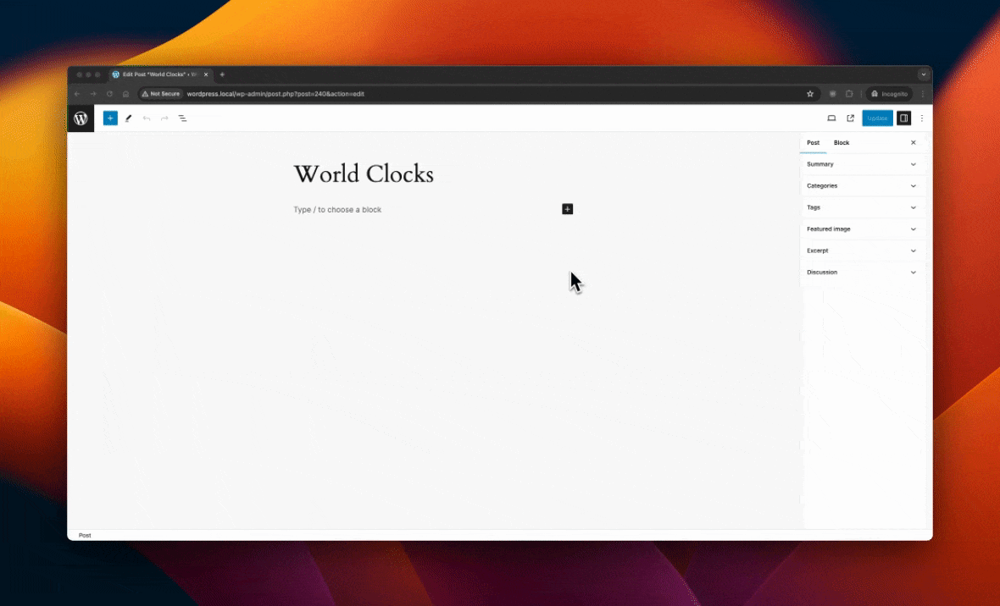
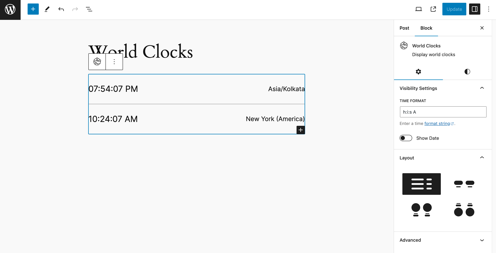
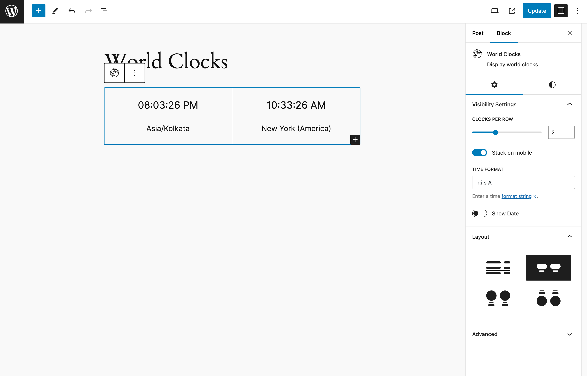
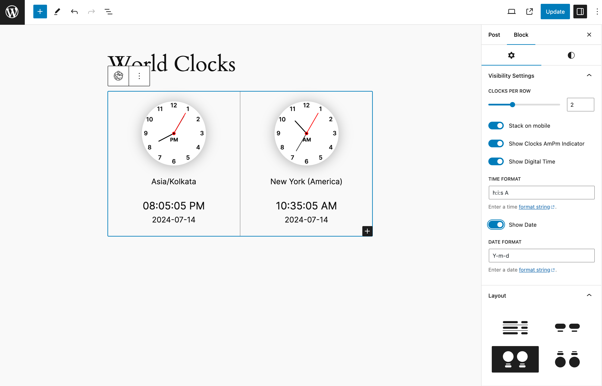
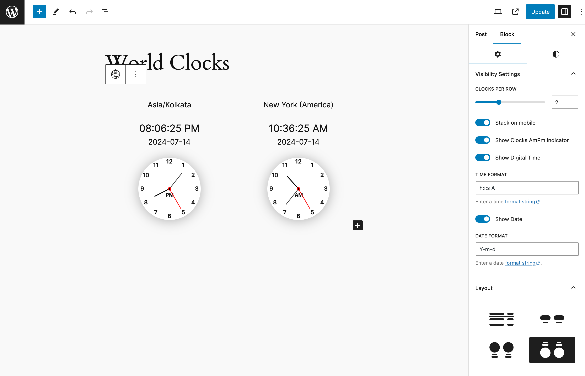
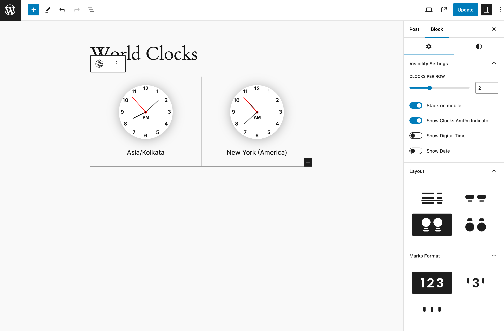
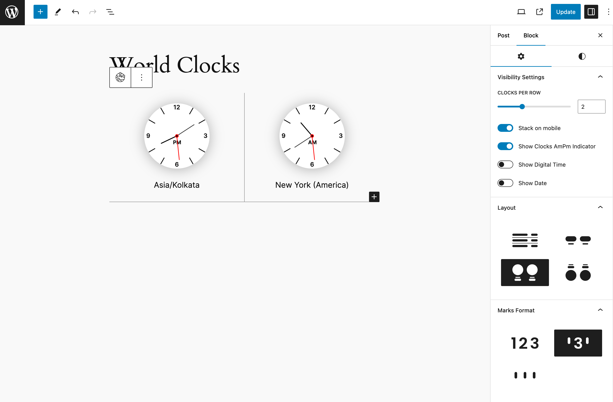
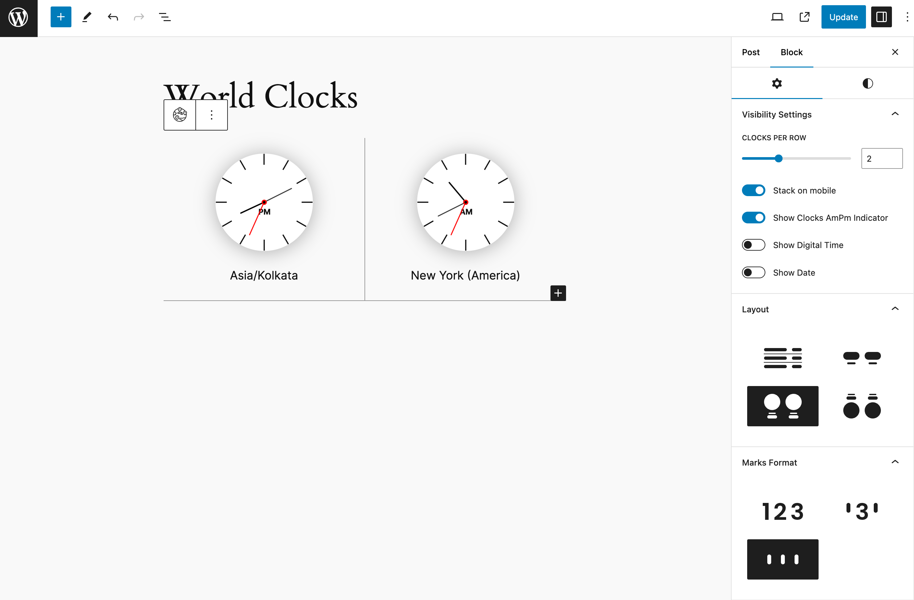

# World Clocks

> Enable world clocks for the sites with different timezones, with a custom block for the WordPress block editor (Gutenberg).

## Overview

World clocks are an essential tool for tracking the current time across different time zones around the globe. They are widely used in various contexts, such as international business, travel, and global communication.

*Inspiration: [World Clock for WordPress](https://www.commoninja.com/widgets/world-clock/wordpress)*

## Requirements

* [PHP](https://www.php.net/) 8.0+
* [WordPress](http://wordpress.org/) 6.5+

## Installation

1. Install through the WordPress plugin directory or download, unzip and upload the files to your `/wp-content/plugins/` directory.
2. Activate the plugin.

### Manual Installation from GitHub repo

1. Download the ZIP file from this [repo](https://github.com/sanketio/world-clocks/archive/refs/heads/trunk.zip).
2. Extract the ZIP file, rename it to `world-clocks` if it's not the extracted directory name, and place it in your site's `wp-content/plugins` directory.
3. Open the terminal and go to `wp-content/plugins/world-clocks`
4. Install composer dependencies: `composer install --no-dev`
5. Install NPM dependencies:
   1. `set +a && nvm install`
   2. `nvm use`
   3. `npm install`
   4. `npm run build`
6. Activate the plugin.

## Configuration

There are two blocks available with this plugin:

1. ***World Clocks*** - The parent block consists of different clocks.
2. ***Single Clock*** - The single (child) clock block which can be added inside the World Clocks block.

### Block: World Clocks (Parent Block)

#### Insert World Clocks Block

Try to search for ***World Clocks*** block while adding a new block to the block editor.

*You can find various methods to insert a block into the block editor using this documentation: [Adding a new block](https://wordpress.org/documentation/article/adding-a-new-block/).*

#### Select Layout

Once a block is inserted, it will ask you to select a layout.

There are four layouts:

1. Digital Row - ***Default*** : This will show world clocks as digital clocks in rows.
2. Digital Column : This will show world clocks as digital clocks in columns.
3. Clock : This will show world clocks as analog clocks in columns with timezone showing below the clock.
4. Clock Reverse : This will show world clocks as analog clocks in columns with timezone showing above the clock.

You can also skip selecting a layout, and it will be set to default layout: ***Digital Row***

You will be able to change the layout from the block settings even after you have selected one or skipped.

#### Block Settings

The ***World Clocks*** block has three settings panel:

1. Visibility Settings
2. Layout
3. Marks Format

##### Visibility Settings

The Visibility Settings panel has different options based on the selected layout.

* Clocks per row
  * When the selected layout is ***Digital Column***, ***Clock*** or ***Clock Reverse***, this setting will be shown to manage the number of clocks in a single row. You can show up to 4 in a single row. Default is ***2***.

* Stack on mobile
  * When the selected layout is ***Digital Column***, ***Clock*** or ***Clock Reverse***, this setting will be shown to manage the stacking of the clock cloumns. If enabled, the clock columns will be stacked for below 768px device sizes. Default is ***enabled***.

* Show Clocks AmPm Indicator
  * When the selected layout is ***Clock*** or ***Clock Reverse***, this setting will be shown. If enabled, it will show AM/PM indicator inside the clock face. Default is ***enabled***.

* Show Digital Time
  * When the selected layout is ***Clock*** or ***Clock Reverse***, this setting will be shown. If enabled, it will show digital clock as well right below/above the analog clock depending on the layout. Default is ***disabled***.

* Time Format
  * When the ***Show Digital Time*** setting is enabled or the selected layout is ***Digital Row*** or ***Digital Column***, this setting will be shown. It allows to show digital time in allowed time formats. Default is ***h:i:s A***, i.e., 01:01:01 AM.
  * Reference for the [time format string](https://wordpress.org/documentation/article/customize-date-and-time-format/).
  * The date format keys ("d", "j", "S", "l", "D", "m", "n", "F", "M", "Y", "y", "c", "r", "U") are not allowed in time format.

* Show Date
  * This setting will be shown with all the layouts. If enabled, it will show the date right below/above the analog/digital clock depending on the layout. Default is ***disabled***.

* Date Format
  * When the ***Show Date*** setting is enabled, this setting will be shown with all the layouts. It allows to show the date in allowed date formats. Default is ***Y-m-d***, i.e., 2024-01-01.
  * Reference for the [date format string](https://wordpress.org/documentation/article/customize-date-and-time-format/).
  * The time format keys ("a", "A", "g", "h", "G", "H", "i", "s", "T", "c", "r", "U") are not allowed in date format.

##### Layout

There are four available layouts to choose from:

1. Digital Row - ***Default*** : This will show world clocks as digital clocks in rows.

2. Digital Column : This will show world clocks as digital clocks in columns.

3. Clock : This will show world clocks as analog clocks in columns with timezone showing below the clock.

4. Clock Reverse : This will show world clocks as analog clocks in columns with timezone showing above the clock.

##### Marks Format

This setting panel will only appear if the selected layout is ***Clock*** or ***Clock Reverse***.

There are three available options to choose from:

1. Number - ***Default*** : This will show the marks as numbers in analog clock.

2. Combine : This will show the marks as combined in analog clock. The numbers - 3, 6, 9 and 12 - will be shown as numbers, and the rset will be show as a line.

3. Line : This will show the marks as line in analog clock.

### Block: Single Clock (Child Block)

You can insert Single Clock block as many as you'd like inside the parent World Clocks block.

#### Select Timezone

You can select any timezone from the available list by just clicking on the timezone textbox and start typing. You can remove existing selected timezone and search for more.

A custom timezone selector with autocomplete is created for this. A custom helper method outputs the available timezones, similarly [wp_timezone_choice()](https://developer.wordpress.org/reference/functions/wp_timezone_choice/).

#### Timezone Label

You can override the default timezone label with your own.

## Changelog

A complete listing of all notable changes to World Clocks are documented in [CHANGELOG.md](https://github.com/sanketio/world-clocks/blob/trunk/CHANGELOG.md).

## Contributing

Please read [CONTRIBUTING.md](https://github.com/sanketio/world-clocks/blob/trunk/CONTRIBUTING.md) for details on the process for submitting pull requests to us, and [CREDITS.md](https://github.com/sanketio/world-clocks/blob/trunk/CREDITS.md) for a listing of maintainers and contributors used by World Clocks.
